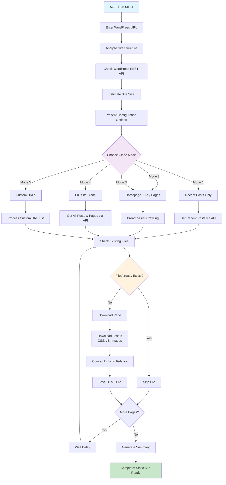

# WordPress Website Cloner

A Python tool for creating static copies of WordPress websites with intelligent crawling and batch download capabilities.

## Features

- **WordPress Site Analysis**: Analyzes site structure and content via REST API
- **Multiple Cloning Modes**: 
  - Recent posts only
  - Homepage + key pages
  - Homepage + random posts
  - Full site clone
  - Custom URL specification
- **Batch Download Support**: Skip existing files to continue downloads incrementally
- **Asset Download**: Downloads CSS, JavaScript, and images with local path conversion
- **Respectful Crawling**: Configurable delays and limits

## How It Works



## Installation

1. Clone this repository
2. Create a virtual environment:
   ```bash
   python3 -m venv wordpress-cloner-env
   source wordpress-cloner-env/bin/activate  # On Windows: wordpress-cloner-env\Scripts\activate
   ```
3. Install dependencies:
   ```bash
   pip install requests beautifulsoup4 lxml
   ```

## Usage

```bash
python3 website_cloner.py https://example.com
```

The script will:
1. Present a main menu with options to count, clone, or both
2. Analyze the WordPress site structure (if counting)
3. Present interactive configuration options (if cloning)
4. Download and save pages with assets
5. Create a static copy in the `cloned_[domain]` directory

## Interactive UI Examples

### Main Menu
```
🔍 Complete WordPress Site Analyzer & Cloner
🎯 Target: https://example.com

============================================================
🎯 MAIN MENU
============================================================
What would you like to do?
   1. Count URLs only (quick analysis)
   2. Clone site only (skip counting)
   3. Both count and clone (recommended)
   4. Exit

   Enter choice (1/2/3/4, default 1): 1
   ✅ Selected: Count URLs only
```

### Site Analysis
```
🔍 Complete WordPress Site Analyzer & Cloner
🎯 Target: https://example.com

🔍 Analyzing https://example.com...
🗺️  Checking sitemap hierarchy...
   ✅ Found top-level sitemap: https://example.com/sitemap_index.xml
   📋 This is a sitemap index with 4 sub-sitemaps:
      1. sitemap-posts.xml: 150 URLs
      2. sitemap-pages.xml: 25 URLs
      3. sitemap-categories.xml: 12 URLs
      4. sitemap-tags.xml: 45 URLs
   📊 Total internal URLs collected: 232
   💾 Saved 232 URLs to cloned_example_com/all_sitemap_urls.txt
   💾 Saved 150 URLs to cloned_example_com/sitemap-posts.xml_urls.txt
   💾 Saved 25 URLs to cloned_example_com/sitemap-pages.xml_urls.txt

📋 SITE ANALYSIS (from sitemap):
   📝 Posts: 150
   📄 Pages: 25
   📂 Categories: 12
   🏷️  Tags: 45
   📊 Total URLs: 232
   🟡 MEDIUM SITE - Consider batching
   ℹ️  Recommendation based on sitemap count (232 URLs)
```

### Smart Configuration (Small Site - ≤300 URLs)
```
============================================================
🛠️  CLONING CONFIGURATION
============================================================
Site has 35 posts and 4 pages
📊 Total URLs available: 42

🔍 Checking 42 URLs from all_sitemap_urls.txt...
📋 Found 15 URLs that need to be downloaded:
    1. https://fingreen.org/
    2. https://fingreen.org/about/
    3. https://fingreen.org/resources/
    4. https://fingreen.org/news/
    5. https://fingreen.org/post-1/
   ... and 10 more

📋 MISSING URLS DETECTED:
   📊 15 URLs need to be downloaded
   🎯 These will be prioritized for cloning

✅ SMALL SITE DETECTED (42 URLs)
   📊 Total URLs is less than cut-off of 300
   🚀 Will proceed with full clone
   ⏱️  Estimated time: ~5 minutes
   ⚙️  Auto-configured settings:
      • Max pages: 300
      • Crawl depth: 10
      • Request delay: 1.0s
      • Auto-open browser: Yes
```

### Smart Skip (All URLs Already Exist)
```
============================================================
🛠️  CLONING CONFIGURATION
============================================================
Site has 35 posts and 4 pages
📊 Total URLs available: 42
📁 Found 51 existing HTML files in cloned_fingreen_org
   These will be skipped to avoid re-downloading
🔍 Checking 42 URLs from all_sitemap_urls.txt...
✅ All URLs from sitemap already exist as HTML files

✅ ALL URLS ALREADY EXIST:
   📊 All URLs from sitemap already have HTML files
   🚀 Will skip to completion summary

✅ SMALL SITE DETECTED (42 URLs)
   📊 Total URLs is less than cut-off of 300
   🚀 Will proceed with full clone
   ⏱️  Estimated time: ~5 minutes
   ⚙️  Auto-configured settings:
      • Max pages: 300
      • Crawl depth: 10
      • Request delay: 1.0s
      • Auto-open browser: Yes

🚀 Starting clone of https://fingreen.org
📋 Found 0 URLs to process

🔄 PROCESSING PAGES:

🎉 CLONING COMPLETED!
📊 Pages processed: 0
📁 Output directory: cloned_fingreen_org

📋 BATCH SUMMARY:
   📄 New pages downloaded: 0
   ⏭️  Pages already existed: 51
   📊 Total pages in directory: 51

🌐 Opening cloned site...
🌐 Opened cloned_fingreen_org/index.html in your default browser
```

### Manual Configuration (Large Site - >300 URLs)
```
============================================================
🛠️  CLONING CONFIGURATION
============================================================
Site has 150 posts and 25 pages
📊 Total URLs available: 500

📊 LARGE SITE DETECTED (500 URLs)
   ⏱️  Time estimates:
      • 300 URLs: ~5 minutes
      • Every additional 60 URLs: +1 minute
      • Your site (500 URLs): ~8 minutes

1️⃣ How many pages maximum do you want to clone?
   Current default: 50
   Recommended for testing: 50-100
   For full clone: 500
   Enter max pages (or press Enter for default): 100

2️⃣ What content do you want to clone?
   1. Recent posts only (quick test)
   2. Homepage + key pages only
   3. Homepage + random sample of posts
   4. All posts and pages (full clone)
   5. Custom URLs (specify exact pages/paths)
   Enter choice (1/2/3/4/5): 2

3️⃣ How deep should the crawler go?
   1 = Only direct links
   2 = Two levels deep (recommended)
   3 = Three levels deep
   10 = Maximum depth (for large sites)
   Enter depth (1-10, default 2): 2

4️⃣ Delay between requests (be nice to the server)
   Current: 1 seconds
   Minimum: 1 second (recommended for large sites)
   Enter delay in seconds (or press Enter): 1.5

✅ CONFIGURATION SUMMARY:
   📊 Max pages: 100
   📝 Clone mode: minimal
   🔍 Crawl depth: 2
   ⏱️  Request delay: 1.5s

   Proceed with these settings? (y/n): y
```

### Custom URL Input (Mode 5)
```
📋 CUSTOM URL INPUT
   You can specify URLs in several ways:
   1. Full URLs: https://www.example.com/about/
   2. Paths only: /about/ or about/
   3. Multiple URLs separated by commas
   4. One URL per line (press Enter twice when done)

   Examples:
   • /about/, /contact/, /products/
   • https://www.example.com/specific-post/
   • category/electronics/

   Choose input method (1=single line, 2=multiple lines): 1

   Enter URLs (separated by commas): /about/, /contact/, /products/, /blog/
   ✅ Added: https://example.com/about/
   ✅ Added: https://example.com/contact/
   ✅ Added: https://example.com/products/
   ✅ Added: https://example.com/blog/
   🏠 Added homepage: https://example.com

   📊 Total custom URLs: 5
```

### Download Progress
```
🚀 Starting clone of https://example.com

📁 Found 12 existing HTML files in cloned_example_com
   These will be skipped to avoid re-downloading

🗺️  Using sitemap URLs (much faster than API)
✅ Added homepage: https://example.com
✅ Added 163 URLs from sitemap
⏭️  Skipped 12 URLs (already exist)

📋 Using custom URLs:
    1. ✅ https://example.com
    2. ✅ https://example.com/about/
    3. ⏭️  SKIPPED (already exists): https://example.com/contact/
    4. ✅ https://example.com/products/
    5. ✅ https://example.com/blog/

📊 Summary: 4 new URLs, 1 already exist

📋 PROCESSING ORDER:
    1. 🏠 Homepage: https://example.com
    2. 📄 Custom Page: https://example.com/about/
    3. 📄 Custom Page: https://example.com/products/
    4. 📄 Custom Page: https://example.com/blog/

🔄 PROCESSING PAGES:

[ 1/ 4] 🌐 Processing: https://example.com
   📦 Downloading assets...
   📁 Downloaded asset: style.css
   📁 Downloaded asset: script.js
   📁 Downloaded asset: logo.png
   ✅ Saved: index.html

[ 2/ 4] 🌐 Processing: https://example.com/about/
   📦 Downloading assets...
   ✅ Saved: about_.html

[ 3/ 4] ⏭️  SKIPPED (already exists): https://example.com/contact/ -> contact_.html

[ 4/ 4] 🌐 Processing: https://example.com/products/
   📦 Downloading assets...
   ✅ Saved: products_.html
```

### Completion Summary
```
🎉 CLONING COMPLETED!
📊 Pages processed: 3
📁 Output directory: cloned_example_com
🌐 Open cloned_example_com/index.html to view

📋 BATCH SUMMARY:
   📄 New pages downloaded: 3
   ⏭️  Pages already existed: 12
   📊 Total pages in directory: 15

📋 CUSTOM URLS CLONED:
   📄 Total custom pages: 3
   🏠 Homepage included: Yes
```

## Configuration Options

- **Max Pages**: Limit the number of pages to download
- **Clone Mode**: Choose from 5 different cloning strategies
- **Crawl Depth**: Control how deep the crawler goes (1-3 levels)
- **Request Delay**: Set delays between requests to be respectful to servers

## Batch Downloads

The tool supports incremental downloads:
- Automatically detects existing HTML files
- Skips already downloaded pages
- Perfect for large sites that need to be downloaded in batches

## Output Structure

```
cloned_example_com/
├── index.html (homepage)
├── assets/
│   ├── css/
│   ├── js/
│   └── images/
├── page1.html
├── page2.html
└── ...
```

## Requirements

- Python 3.7+
- requests
- beautifulsoup4
- lxml

## License

This project is open source. Use responsibly and respect website terms of service and robots.txt files.

## Disclaimer

This tool is for educational and legitimate backup purposes only. Always ensure you have permission to clone websites and respect copyright laws.
